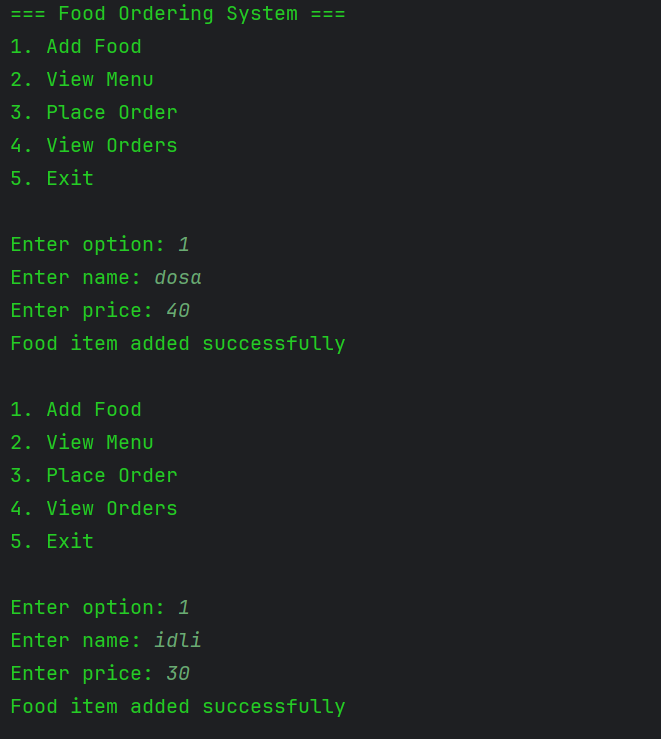
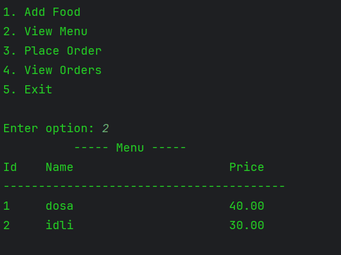
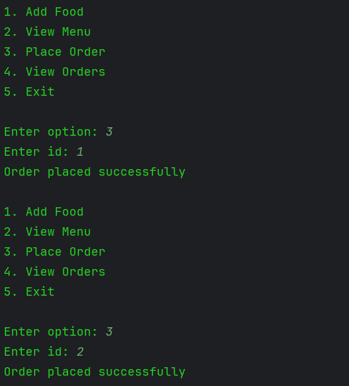
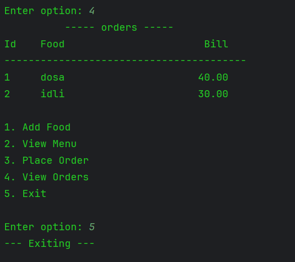

---

## ▶️ How to Run
1. Clone the repository
2. Open the project in IntelliJ IDEA
3. Run `FoodappApplication`

---

## 📷 Sample Output

### ➕ Add Food

### 📄 View Menu

### 🧾 Place Order

### 📦 View Orders

---

## 🎯 Key Learning Outcomes
- Built a multi-service system using Spring Core
- Understood dependency chaining between services
- Implemented real-world backend flow for order processing
- Practiced clean code and modular design

---

## 📌 Author
Bhanu